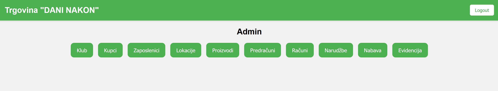
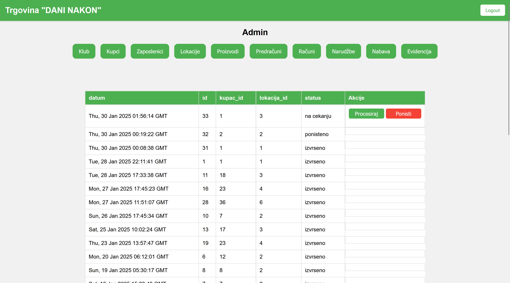

## Autori
Projekt su razvili studenti Fakulteta Informatike u Puli:
- **Leonarda Prpić**
- **Dominik Ćurić**
- **Filip Lukes**
- **Renzo Ermacora**
- **Gabriel Pavić**

## Opis projekta
Ovaj projekt je razvijen za predmet Baze Podataka 2. Tema koju smo mi odabrali je lanac trgovina pod imenom "Dani nakon" te se sastoji od fizičkih trgovina i Internet trgovine. Tehnologije koje smo odlučili koristiti su MySQL za bazu podataka, Flask kao naš web framework te uz njega kombinaciju html-a, css-a i javascripta za izradu same web stranice. 
Što se same trgovine tiče, proizvoda ima svakakvih, od vrtne garniture, preko hrane i pića sve do jeftine kineske elektronike. Svi ti proizvodi se onda dijele na trgovine koje su na svojim lokacijama te svaka ima pripadajuće skladište. Internet trgovina kombinira njihove proizvode te ovisno o privilegijama korisnika(admin, user, zaposlenik, gost) može se kupovati i/ili upravljati samim lancem trgovina.


Napomena: može biti samo jedna poslovnica po gradu  te zaposlenik može raditi u samo jednoj poslovnici radi jednostavnosti.

# Dokumentacija baze podataka: `trgovina`

Ova baza podataka modelira poslovne procese unutar trgovine. Struktura baze omogućuje upravljanje kupcima, zaposlenicima, proizvodima, transakcijama, zalihama i drugim ključnim elementima poslovanja.

---

## Sadržaj 
1. [Dijagram EER](#dijagram-eer)
2. [Dijagram ERD](#dijagram-erd)
3. [Instalacija i pokretanje](#instalacija-i-pokretanje)
4. [Web](#web-api)
5. [Opis tablica](#opis-tablica)  (#validacijska-pravila-i-ograničenja) 
6. [Pogled kupca](#pogled-kupca)
7. [Pogled admina](#pogled-admina)  
8. [Funkcije](#funkcije)
9. [Okidači](#okidači)

---

## Dijagram EER 


---

## Dijagram ERD


## Instalacija i pokretanje


```
git clone https://github.com/LordJellyfish13/trgovina_dani_nakon.git
```

Nakon kloniranja projekta je potrebno otvoriti MySQL Workbench i pokrenuti skriptu `db.sql` koja će stvoriti bazu podataka i popuniti je podacima.

```
cd trgovina_dani_nakon
```

```
py -m venv env
```

```
env\Scripts\activate
```

```
pip install -r requirements.txt
```

```
py app.py
```

```
otvoriti index.html u internet pregledniku
```

--

## Web

>Koristimo Flask kao web framework te html, css i javascript za izradu web stranice. Za komunikaciju s bazom podataka koristimo flask-mysqldb. 
```
app.config['MYSQL_HOST'] = 'localhost'
app.config['MYSQL_USER'] = 'web'
app.config['MYSQL_PASSWORD'] = 'web'
app.config['MYSQL_DB'] = 'trgovina'
app.config['MYSQL_CURSORCLASS'] = 'DictCursor'
mysql = MySQL(app)
```

> Napravili smo korisnika web koji ima sve privilegije na bazi trgovina osim DROP privilegija.
```
CREATE USER IF NOT EXISTS 'web'@'localhost' IDENTIFIED BY 'web';
GRANT ALL PRIVILEGES ON trgovina.* TO 'web'@'localhost';
REVOKE DROP ON trgovina.* FROM 'web'@'localhost';
FLUSH PRIVILEGES;
```

> Na webu se koriste dummy podatci za admina.

## Opis tablica

### 1. `klub`
Tablica koja pohranjuje podatke o razinama članstva u klubu lojalnosti kupaca.
- **Atributi**:
  - `id` (INT, primarni ključ, AUTO_INCREMNET)
  - `razina` (VARCHAR(50), razina članstva)
  - `popust` (INT, postotak popusta)

```
CREATE TABLE klub (
	id INT AUTO_INCREMENT PRIMARY KEY,
    razina VARCHAR(50) NOT NULL,
    popust INT NOT NULL
);
```

---

### 2. `lokacija`
Tablica koja pohranjuje podatke o gradovima u kojima trgovina posluje.
- **Atributi**:
  - `id` (INT, primarni ključ)
  - `grad` (VARCHAR(50), naziv grada)


```
CREATE TABLE lokacija (
	id INT AUTO_INCREMENT PRIMARY KEY,
    grad VARCHAR(50) NOT NULL
);
```

---

### 3. `odjel`
Tablica koja definira različite odjele unutar trgovine.
- **Atributi**:
  - `id` (INT, primarni ključ)
  - `naziv` (VARCHAR(100), naziv odjela)

```
CREATE TABLE odjel (
	id INT AUTO_INCREMENT PRIMARY KEY,
    naziv VARCHAR(100) NOT NULL
);
```

---

### 4. `odjel_na_lokaciji`
Tablica koja povezuje odjele s njihovim lokacijama.
- **Atributi**:
  - `id` (INT, primarni ključ)
  - `odjel_id` (INT, strani ključ prema `odjel.id`)
  - `lokacija_id` (INT, strani ključ prema `lokacija.id`)

```
CREATE TABLE odjel_na_lokaciji (
	id INT AUTO_INCREMENT PRIMARY KEY,
    odjel_id INT NOT NULL,
    lokacija_id INT NOT NULL,
    FOREIGN KEY (odjel_id) REFERENCES odjel(id),
    FOREIGN KEY (lokacija_id) REFERENCES lokacija(id)
);
```

---

### 5. `zaposlenik`
Tablica za evidenciju zaposlenika.
- **Atributi**:
  - `id` (INT, primarni ključ)
  - `ime` (VARCHAR(50))
  - `prezime` (VARCHAR(50))
  - `mjesto_rada` (INT, strani ključ prema `odjel_na_lokaciji.id`)
  - `placa` (DECIMAL(10, 2))
  - `spol` (CHAR(1), moguće vrijednosti: "M" ili "Ž")

```
CREATE TABLE zaposlenik (
	id INT AUTO_INCREMENT PRIMARY KEY,
    ime VARCHAR(50) NOT NULL,
    prezime VARCHAR(50) NOT NULL,
    mjesto_rada INT NOT NULL, -- (odjel_na_lokaciji id)
    placa DECIMAL(10, 2) NOT NULL,
    spol CHAR(1) NOT NULL,
    CONSTRAINT zaposlenik_spol_provjera CHECK (spol = "M" OR spol = "Ž"),
    FOREIGN KEY (mjesto_rada) REFERENCES odjel_na_lokaciji(id)
);
```

---

### 6. `kupac`
Tablica za pohranu podataka o kupcima.
- **Atributi**:
  - `id` (INT, primarni ključ)
  - `ime` (VARCHAR(50))
  - `prezime` (VARCHAR(50))
  - `spol` (CHAR(1), moguće vrijednosti: "M" ili "Ž")
  - `adresa` (VARCHAR(100))
  - `email` (VARCHAR(50))
  - `tip` (VARCHAR(50), privatni ili poslovni)
  - `oib_firme` (CHAR(11), opcionalno)
  - `klub_id` (INT, strani ključ prema `klub.id`)

```
CREATE TABLE kupac (
	id INT AUTO_INCREMENT PRIMARY KEY,
    ime VARCHAR(50) NOT NULL,
    prezime VARCHAR(50) NOT NULL,
    spol CHAR(1) NOT NULL,
    adresa VARCHAR(100) NOT NULL,
    email VARCHAR(50) NOT NULL,
    tip VARCHAR(50) NOT NULL,
    oib_firme CHAR(11),
    klub_id INT DEFAULT 1,
    FOREIGN KEY (klub_id) REFERENCES klub(id),
    CONSTRAINT kupac_spol_provjera CHECK (spol = "M" OR spol = "Ž"),
    CONSTRAINT tip_kupca_check CHECK (tip = 'privatni' OR tip = 'poslovni')
);
```

---

### 7. `kategorija`
Tablica za klasifikaciju proizvoda.
- **Atributi**:
  - `id` (INT, primarni ključ)
  - `naziv` (VARCHAR(50))
  - `odjel_id` (INT, strani ključ prema `odjel.id`)

```
CREATE TABLE kategorija (
	id INT AUTO_INCREMENT PRIMARY KEY,
    naziv VARCHAR(50),
    odjel_id INT,
    FOREIGN KEY (odjel_id) REFERENCES odjel(id)
);
```
---

### 8. `proizvod`
Tablica za pohranu informacija o proizvodima.
- **Atributi**:
  - `id` (INT, primarni ključ)
  - `naziv` (VARCHAR(100), jedinstven)
  - `nabavna_cijena` (DECIMAL(10, 2))
  - `prodajna_cijena` (DECIMAL(10, 2))
  - `kategorija_id` (INT, strani ključ prema `kategorija.id`)
  - `popust_tip` (VARCHAR(30), opcionalno)

```
CREATE TABLE proizvod (
	id INT AUTO_INCREMENT PRIMARY KEY,
    naziv VARCHAR(100) NOT NULL,
    nabavna_cijena DECIMAL(10, 2) NOT NULL,
    prodajna_cijena DECIMAL(10, 2) NOT NULL,
    kategorija_id INT,
    popust_tip VARCHAR(30) DEFAULT NULL,
    FOREIGN KEY (kategorija_id) REFERENCES kategorija(id),
    CONSTRAINT provjera_cijene CHECK (nabavna_cijena > 0 AND prodajna_cijena > 0),
    CONSTRAINT popust_tip_provjera CHECK (popust_tip IS NULL OR popust_tip = "klub" OR popust_tip = "kolicina"),
    CONSTRAINT greska_ime_proizvoda UNIQUE (naziv)
);
```

---

### 9. `predracun` i `racun`
Tablice za upravljanje predračunima i računima.
- **Atributi**:
  - `id` (INT, primarni ključ)
  - `kupac_id` (INT, strani ključ prema `kupac.id`)
  - `zaposlenik_id` (INT, strani ključ prema `zaposlenik.id`)
  - `datum` (DATETIME)
  - `nacin_placanja` (samo u `racun`, VARCHAR(30), npr. "POS" ili "gotovina")
  - `status` (VARCHAR(30), moguće vrijednosti: "na cekanju", "izvrseno", "ponisteno")


```
CREATE TABLE predracun (
	id INT AUTO_INCREMENT PRIMARY KEY,
    kupac_id INT,
    zaposlenik_id INT NOT NULL,
    datum DATETIME NOT NULL DEFAULT NOW(),
    status VARCHAR(30) NOT NULL DEFAULT "na cekanju",
    FOREIGN KEY (kupac_id) REFERENCES kupac(id),
    FOREIGN KEY (zaposlenik_id) REFERENCES zaposlenik(id),
    CONSTRAINT provjera_statusa_predracuna CHECK(status = "na cekanju" OR status = "izvrseno" OR status = "ponisteno")
);

CREATE TABLE racun (
	id INT AUTO_INCREMENT PRIMARY KEY,
    kupac_id INT,
    zaposlenik_id INT NOT NULL,
    datum DATETIME NOT NULL DEFAULT NOW(),
    nacin_placanja VARCHAR(30) NOT NULL,
    status VARCHAR(30) NOT NULL DEFAULT "na cekanju",
    FOREIGN KEY (kupac_id) REFERENCES kupac(id),
    FOREIGN KEY (zaposlenik_id) REFERENCES zaposlenik(id),
    CONSTRAINT provjera_nacina_placanja CHECK (nacin_placanja = "POS" OR nacin_placanja = "gotovina"),
    CONSTRAINT provjera_statusa_racuna CHECK (status = "izvrseno" OR status = "na cekanju" OR status = "ponisteno")
);
```

---

### 10. `nabava` i `narudzba`
Tablice za upravljanje nabavom i narudžbama. Nabava je po default-u "na čekanju" dok kad se krene izvršavati prelazi u narudžbu.
- **Atributi**:
  - `id` (INT, primarni ključ)
  - `lokacija_id` (INT, strani ključ prema `lokacija.id`)
  - `kupac_id` (INT, strani ključ prema `kupac.id`, samo u `narudzba`)
  - `datum` (DATETIME)
  - `status` (VARCHAR(30), moguće vrijednosti: "na cekanju", "izvrseno", "ponisteno")

```
CREATE TABLE nabava (
	id INT AUTO_INCREMENT PRIMARY KEY,
    lokacija_id INT,
    datum DATETIME DEFAULT NOW(),
    status VARCHAR(50) DEFAULT 'na cekanju',
    CONSTRAINT provjera_statusa_nabave CHECK (status = 'na cekanju' OR status = 'izvrseno' OR status = 'ponisteno'),
    FOREIGN KEY (lokacija_id) REFERENCES lokacija(id)
);

CREATE TABLE narudzba (
	id INT AUTO_INCREMENT PRIMARY KEY,
    datum DATETIME DEFAULT NOW(),
    lokacija_id INT,
    kupac_id INT,
    status VARCHAR(50) DEFAULT 'na cekanju', -- status je dozvoljena rijec za naziv atributa, iako je highlightana
    FOREIGN KEY (kupac_id) REFERENCES kupac(id),
    FOREIGN KEY (lokacija_id) REFERENCES lokacija(id),
    CONSTRAINT provjera_statusa_narudzbe CHECK (status = "na cekanju" OR status = "izvrseno" OR status = "ponisteno")
);
```

---

### 11. `stavka`
Tablica koja bilježi pojedinačne stavke računa, predračuna, nabave i narudžbi.
- **Atributi**:
  - Strani ključevi prema `predracun`, `racun`, `nabava`, `narudzba`
  - `proizvod_id` (INT, strani ključ prema `proizvod.id`)
  - `cijena`, `kolicina`, `ukupan_iznos`, `popust`, `nakon_popusta`

```
CREATE TABLE stavka (
	predracun_id INT DEFAULT NULL,
    racun_id INT DEFAULT NULL,
    nabava_id INT DEFAULT NULL,
    narudzba_id INT DEFAULT NULL,
    proizvod_id INT NOT NULL,
    proizvod_naziv VARCHAR(100),
    cijena DECIMAL(10, 2) NOT NULL,
    kolicina INT NOT NULL,
    ukupan_iznos DECIMAL(10, 2) NOT NULL,
    popust DECIMAL(10, 2) DEFAULT NULL,
    nakon_popusta DECIMAL(10, 2) DEFAULT NULL,
    CONSTRAINT kolicina_provjera CHECK (kolicina > 0),
    FOREIGN KEY (predracun_id) REFERENCES predracun(id),
    FOREIGN KEY (racun_id) REFERENCES racun(id),
    FOREIGN KEY (nabava_id) REFERENCES nabava(id),
    FOREIGN KEY (narudzba_id) REFERENCES narudzba(id),
    FOREIGN KEY (proizvod_id) REFERENCES proizvod(id)
);
```


---

### 12. `inventar`
Tablica za praćenje zaliha proizvoda po lokacijama.
- **Atributi**:
  - `lokacija_id` (INT, strani ključ prema `lokacija.id`)
  - `proizvod_id` (INT, strani ključ prema `proizvod.id`)
  - `kolicina` (INT)

```
CREATE TABLE inventar (
	lokacija_id INT NOT NULL,
    proizvod_id INT NOT NULL,
    kolicina INT NOT NULL,
    CONSTRAINT provjera_kolicine_inventara CHECK (kolicina >= 0),
    FOREIGN KEY (lokacija_id) REFERENCES lokacija(id),
    FOREIGN KEY (proizvod_id) REFERENCES proizvod(id)
);
```

---

### 13. `evidencija`
Tablica za bilježenje operacija u sustavu.
- **Atributi**:
  - `opis` (VARCHAR(255))
  - `vrijeme` (DATETIME)

```
CREATE TABLE evidencija(
	opis VARCHAR(255),
    vrijeme DATETIME DEFAULT NOW()
);
```

---


## Validacijska pravila i ograničenja

- **Provjere vrijednosti**:
  - `spol` atributi u tablicama `zaposlenik` i `kupac`.
  - `cijene` u tablici `proizvod`.
  - `status` atributi u `racun` i `narudzba`.
- **Jedinstvenost**:
  - Nazivi proizvoda (`proizvod.naziv`).
- **Vanjski ključevi**:
  - Veze između tablica osiguravaju konzistentnost podataka.

## Globalni okidači i pogledi

> Procedura `stvori_zapis` koja stvara zapis u tablici `evidencija` pomoću triggera.
``` 
DELIMITER //
CREATE PROCEDURE stvori_zapis(IN poruka VARCHAR(255))
BEGIN
	INSERT INTO evidencija VALUES (poruka, NOW());
END //
DELIMITER ;
```

## Pogled kupca

### Kupovina i odjeli
Ova sekcija opisuje kako kupci mogu pregledavati proizvode unutar različitih odjela trgovine. Kupci mogu filtrirati proizvode prema odjelima, što im omogućuje lakše pronalaženje željenih artikala. Svaki odjel sadrži specifične proizvode koji su dostupni za kupovinu, a korisnici mogu dodavati proizvode u svoju košaricu te završiti kupovinu otvaranjem košraice, upisivanjem njihovog ID-a i lokacije željene trgovine.

>Odabir odjela i kategorije, te dodavanje proizvoda u košaricu


> Pregled proizvoda po odjelima i kategorijama pomoću pogleda `pregled_proizvoda` koji odabire sve proizvode iz tablice `proizvod` i spaja ih s tablicama `kategorija` i `odjel`
```
CREATE OR REPLACE VIEW pregled_proizvoda AS
    SELECT p.*, k.naziv AS kategorija_naziv, o.naziv AS odjel_naziv
    FROM proizvod p
    LEFT JOIN kategorija k ON p.kategorija_id = k.id 
    LEFT JOIN odjel o ON k.odjel_id = o.id;
```

> Otvaranje košarice i upisivanje ID-a i lokacije


> Pregled proizvoda u košarici se prikazuje pomoću prvobitne prazne liste odabrani proizvodi u script.js. S tom listom onda se ispisuje na ikoni košarice broj proizvoda u njoj. Unutar scrip.js-a se grupiraju proizvodi po ID-u te dobivamo količinu po proizvodu. Kada kupac klikne na "Kupi", onda se proizvodi šalju na server i kreira se narudžba pomoću `stvori_narudzbu` i `dodaj_stavke` funkcija. Dodaje se i zapis u tablicu `evidencija` pomoću pogleda `stvori_zapis`.
```
DELIMITER //
CREATE PROCEDURE stvori_narudzbu(IN l_id INT, IN k_id INT)
BEGIN
	INSERT INTO narudzba(lokacija_id, kupac_id) VALUES (l_id, k_id);
    
    CALL stvori_zapis(CONCAT('Stvorena narudzba ID(', LAST_INSERT_ID() ,')'));
END //
DELIMITER ;

DELIMITER //
CREATE PROCEDURE dodaj_stavke(IN json_data JSON)
BEGIN
	
    DECLARE pr_id, r_id, nab_id, nar_id, p_id, l_id, kol INT;
    DECLARE i INT DEFAULT 0;
    DECLARE total_rows INT;    
    
    SET total_rows = JSON_LENGTH(json_data);
	
    START TRANSACTION;
    WHILE i < total_rows DO
		SELECT NULL, NULL, NULL, NULL, NULL INTO pr_id, r_id, nab_id, nar_id, l_id;
		
		SET p_id = JSON_UNQUOTE(JSON_EXTRACT(json_data, CONCAT('$[', i, '].proizvod_id')));
		SET kol = JSON_UNQUOTE(JSON_EXTRACT(json_data, CONCAT('$[', i, '].kolicina')));

		IF JSON_EXTRACT(json_data, CONCAT('$[', i, '].predracun_id')) IS NOT NULL THEN
			SET pr_id = JSON_UNQUOTE(JSON_EXTRACT(json_data, CONCAT('$[', i, '].predracun_id')));
		END IF;

		IF JSON_EXTRACT(json_data, CONCAT('$[', i, '].racun_id')) IS NOT NULL THEN
			SET r_id = JSON_UNQUOTE(JSON_EXTRACT(json_data, CONCAT('$[', i, '].racun_id')));
		END IF;

		IF JSON_EXTRACT(json_data, CONCAT('$[', i, '].nabava_id')) IS NOT NULL THEN
			SET nab_id = JSON_UNQUOTE(JSON_EXTRACT(json_data, CONCAT('$[', i, '].nabava_id')));
		END IF;

		IF JSON_EXTRACT(json_data, CONCAT('$[', i, '].narudzba_id')) IS NOT NULL THEN
			SET nar_id = JSON_UNQUOTE(JSON_EXTRACT(json_data, CONCAT('$[', i, '].narudzba_id')));
		END IF;
        
        IF p_id NOT IN (SELECT id FROM proizvod) THEN
			ROLLBACK;
			SIGNAL SQLSTATE '45000' SET MESSAGE_TEXT = "Nepojstojeci proizvod ID unesen";
		END IF;
        
        IF r_id IS NOT NULL THEN
			IF l_id IS NULL THEN
				SET @z_id = (SELECT zaposlenik_id FROM racun WHERE id = r_id);
				SET l_id = lokacija_zaposlenika(@z_id);
			END IF;
            SET @inventar = (SELECT kolicina FROM inventar WHERE lokacija_id = l_id AND proizvod_id = p_id);
            IF kol > @inventar THEN
				ROLLBACK;
				UPDATE racun SET status = 'ponisteno' WHERE id = r_id;
                SIGNAL SQLSTATE '45000' SET MESSAGE_TEXT = 'Nema dovoljno proizvoda na stanju';
			END IF;
		END IF;
        
		INSERT INTO stavka (predracun_id, racun_id, nabava_id, narudzba_id, proizvod_id, kolicina) 
		VALUES (pr_id, r_id, nab_id, nar_id, p_id, kol);    
        
        SET i = i + 1;
    END WHILE;
    
    IF r_id IS NOT NULL THEN
		UPDATE racun SET status = 'izvrseno' WHERE id = r_id;
    END IF;
    COMMIT;
END //
DELIMITER ;
```

## Pogled admina
> Admin ima 10 opcija za upravljanje podacima i pregled podataka


### Klubovi
> Admin može pregledavati koji klubovi postoje. Razina u kojoj se kupac nalazi i popusti koje dobija se automatski određuje na osnovu kupovine.


> Klikom na gumb Klub se ispisuju svi klubovi i njihovi popusti pomoću selecta `SELECT * FROM klub`

### Kupci
> Admin može pregledavati i dodavati kupce i njihove podatke.


> Klikom na gumb Kupci se ispisuju svi kupci i njihovi podaci pomoću selecta `SELECT * FROM kupac`

> Najčešći kupci i najbolji kupci


> Pogled `najcesci_kupci` koji odabire sve kupce iz tablice `kupac` i spaja ih s tablicom `racun` te grupira ih po kupcu i broji koliko ima računa. 
``` 
CREATE OR REPLACE VIEW najcesci_kupci AS
	SELECT kupac_id, CONCAT(ime, " ", prezime) AS kupac, COUNT(r.id) AS broj_racuna
		FROM racun AS r
		INNER JOIN kupac AS k ON r.kupac_id = k.id
        WHERE r.status = "izvrseno"
		GROUP BY kupac_id
        ORDER BY broj_racuna DESC;
```

> Pogled `najbolji_kupci` koji odabire sve kupce iz tablice `kupac` i spaja ih s tablicom `racun` te grupira ih po kupcu i sumira ukupan iznos računa.
```
CREATE OR REPLACE VIEW najbolji_kupci AS
	SELECT kupac_id, kupac, SUM(ukupan_iznos) AS ukupan_iznos
		FROM pregled_racuna AS pr
		INNER JOIN racun AS r ON pr.racun_id = r.id
		WHERE kupac_id IS NOT NULL AND r.status = "izvrseno"
		GROUP BY kupac_id, kupac
		ORDER BY ukupan_iznos DESC;
```

> Dodavanje kupca


> Procedura `dodaj_kupca` koja dodaje kupca u tablicu `kupac` i stvara zapis u tablici `evidencija` pomoću pogleda `stvori_zapis`.
```
DELIMITER //
CREATE PROCEDURE dodaj_kupca(
	IN ime VARCHAR(50), 
    IN prezime VARCHAR(20), 
    IN spol CHAR(1), 
    IN adresa VARCHAR(100),
    IN email VARCHAR(50), 
    IN tip VARCHAR(50), 
    IN oib_firme CHAR(11)
)
BEGIN
    INSERT INTO kupac(ime, prezime, spol, adresa, email, tip, oib_firme) VALUES (ime, prezime, spol, adresa, email, tip, oib_firme);
    
    CALL stvori_zapis(CONCAT("Dodan kupac ", ime, " ", prezime, " ID(", LAST_INSERT_ID() ,")"));
END //
DELIMITER ;
```

> Procedura `dodaj_kupca` koja dodaje kupca u tablicu `kupac` i stvara zapis u tablici `evidencija` pomoću pogleda `stvori_zapis`.
```
DELIMITER //
CREATE PROCEDURE dodaj_kupca(
	IN ime VARCHAR(50), 
    IN prezime VARCHAR(20), 
    IN spol CHAR(1), 
    IN adresa VARCHAR(100),
    IN email VARCHAR(50), 
    IN tip VARCHAR(50), 
    IN oib_firme CHAR(11)
)
BEGIN
    INSERT INTO kupac(ime, prezime, spol, adresa, email, tip, oib_firme) VALUES (ime, prezime, spol, adresa, email, tip, oib_firme);
    
    CALL stvori_zapis(CONCAT("Dodan kupac ", ime, " ", prezime, " ID(", LAST_INSERT_ID() ,")"));
END //
DELIMITER ;
```

### Zaposlenici
> Admin može pregledavati zaposlenike i njihove podatke.


> Klikom na gumb Zaposlenici se ispisuju svi zaposlenici i njihovi podaci pomoću selecta `SELECT * FROM zaposlenik`

> Zaposlenici s najviše računa i najvećin doprinosom u prodaji


> Pogled `najbolji_zaposlenik_racuni` koji odabire sve zaposlenike iz tablice `zaposlenik` i spaja ih s tablicom `racun` te grupira ih po zaposleniku i broji koliko ima računa.
```
CREATE OR REPLACE VIEW najbolji_zaposlenik_racuni AS
	SELECT CONCAT(ime, " ", prezime) AS zaposlenik, spol, COUNT(r.id) AS broj_racuna
		FROM racun AS r
		INNER JOIN zaposlenik AS z ON r.zaposlenik_id = z.id
        WHERE r.status = "izvrseno"
		GROUP BY z.id
		ORDER BY broj_racuna DESC;
```

> Pogled `najbolji_zaposlenik_zarada` koji odabire sve zaposlenike iz tablice `zaposlenik` i spaja ih s tablicom `racun` te grupira ih po zaposleniku i sumira ukupan iznos računa.
```
CREATE VIEW najbolji_zaposlenik_zarada AS
	SELECT CONCAT(z.ime, ' ', z.prezime) AS zaposlenik, spol, SUM(ukupan_iznos) AS ukupan_iznos
		FROM pregled_racuna AS pr
		INNER JOIN racun AS r ON pr.racun_id = r.id
		INNER JOIN zaposlenik AS z ON r.zaposlenik_id = z.id
		GROUP BY z.id
		ORDER BY ukupan_iznos DESC;
```

> Dodavanje zaposlenika


> Procedura `dodaj_zaposlenika` koja dodaje zaposlenika u tablicu `zaposlenik` i stvara zapis u tablici `evidencija` pomoću pogleda `stvori_zapis`.
```
DELIMITER //
CREATE PROCEDURE dodaj_zaposlenika(
	IN ime VARCHAR(50),
    IN prezime VARCHAR(50),
    IN mjesto_rada INT,
    IN placa DECIMAL(10, 2),
    IN spol CHAR(1)
)
BEGIN
	INSERT INTO zaposlenik(ime, prezime, mjesto_rada, placa, spol) VALUES (ime, prezime, mjesto_rada, placa, spol);
    
    CALL stvori_zapis(CONCAT("Dodan zaposlenik ", ime, " ", prezime, " ID(", LAST_INSERT_ID(), ")"));
END //
DELIMITER ;

-- PROCEDURA ZA PROCESIRANJE PREDRACUNA
DELIMITER //
CREATE PROCEDURE procesiraj_predracun(IN p_id INT)
BEGIN
	DECLARE l_id, k_id, z_id, pro_id, kol INT;
    DECLARE finished INT DEFAULT 0;
	DECLARE cur CURSOR FOR
		SELECT proizvod_id, kolicina FROM predracun_stavke WHERE p_id = predracun_id;
        
	DECLARE CONTINUE HANDLER FOR NOT FOUND SET finished = 1;
	
	IF((SELECT status FROM predracun WHERE p_id = id) != "na cekanju") THEN 
		SIGNAL SQLSTATE '45000' SET MESSAGE_TEXT = "Predracun vec procesiran";
    END IF;
    
    SELECT kupac_id, zaposlenik_id FROM predracun WHERE id = p_id 
		INTO k_id, z_id;
	SET l_id = lokacija_zaposlenika(z_id);
        
    START TRANSACTION;
		CALL stvori_racun(k_id, z_id, "POS");
        SET @r_id = LAST_INSERT_ID();
        UPDATE predracun
			SET predracun.status = "izvrseno"
			WHERE id = p_id;
		UPDATE stavka
			SET racun_id = @r_id
			WHERE predracun_id = p_id;
            
		OPEN cur;
			procesiraj_stavke: LOOP
				FETCH cur INTO pro_id, kol;
                
				IF finished = 1 THEN
					LEAVE procesiraj_stavke;
				END IF;
                
				IF (kol > (SELECT kolicina FROM inventar WHERE l_id = lokacija_id AND pro_id = proizvod_id)) THEN
					ROLLBACK;
					SIGNAL SQLSTATE '45000' SET MESSAGE_TEXT = "Nema dovoljno proizvoda na stanju";
                    
				END IF;
			END LOOP;
		CLOSE cur;
        UPDATE racun
			SET status = "izvrseno"
            WHERE id = @r_id;
    COMMIT;
END //
DELIMITER ;
```

### Lokacije
> Admin može pregledavati  lokacije i odjele na njima.


> Klikom na gumb Lokacije se ispisuju sve lokacije i njihovi odjeli pomoću pogleda `pregled_lokacija_sa_odjelima`

```
CREATE OR REPLACE VIEW pregled_lokacija_sa_odjelima AS
    SELECT l.grad AS lokacija, GROUP_CONCAT(o.naziv SEPARATOR ', ') AS odjeli
    FROM lokacija l
    JOIN odjel_na_lokaciji ona ON l.id = ona.lokacija_id
    JOIN odjel o ON ona.odjel_id = o.id
    GROUP BY l.grad;
```

### Proizvodi
> Admin može pregledavati sve proizvode i njihove podatke. Također može i po lokacijama pregledavati zalihe proizvoda.


> Pogled `svi_proizvodi` koji odabire sve proizvode iz tablice `proizvod` i spaja ih s tablicom `inventar` te ispisuje sve proizvode i njihove podatke.
```
CREATE OR REPLACE VIEW svi_proizvodi AS
	SELECT p.id, p.naziv, i.kolicina, p.nabavna_cijena, p.prodajna_cijena
	FROM proizvod AS p
	LEFT JOIN inventar AS i ON p.id = i.proizvod_id;    
```

> Pogled `proizvodi_na_lokacijama` koji odabire sve proizvode iz tablice `proizvod` i spaja ih s tablicom `inventar` te ispisuje sve proizvode i njihove podatke po lokacijama.
```
CREATE OR REPLACE VIEW proizvodi_na_lokacijama AS
    SELECT p.id AS proizvod_id, p.naziv AS proizvod_naziv, l.grad AS lokacija, SUM(i.kolicina) AS kolicina
    FROM proizvod p
    JOIN inventar i ON p.id = i.proizvod_id
    JOIN lokacija l ON i.lokacija_id = l.id
    GROUP BY p.id, l.grad;
```

> Informacije o najprodavanijim proizvodima i proizvoda koji su prodani najviše


> Pogled `najprodavaniji_proizvodi` koji odabire sve proizvode iz tablice `proizvod` i spaja ih s pogledom `racun_stavke` te ispisuje sve proizvode i njihove podatke po lokacijama.
```
CREATE OR REPLACE VIEW racun_stavke AS
	SELECT racun_id, proizvod_id, proizvod_naziv, cijena, kolicina, ukupan_iznos, popust, nakon_popusta
		FROM stavka
        WHERE racun_id IS NOT NULL;

CREATE OR REPLACE VIEW najprodavaniji_proizvodi AS
	SELECT p.id, p.naziv, SUM(kolicina) AS kolicina
		FROM racun_stavke AS rs
		INNER JOIN proizvod AS p ON rs.proizvod_id = p.id
        INNER JOIN racun AS r ON r.id = rs.racun_id
        WHERE r.status = "izvrseno"
		GROUP BY proizvod_id
		ORDER BY kolicina DESC;
```

> Pogled `najbolja_zarada` koji odabire sve proizvode iz tablice `proizvod` i spaja ih s tablicom `stavka` te ispisuje sve proizvode i njihove podatke po lokacijama.
```
CREATE OR REPLACE VIEW najbolja_zarada AS
	SELECT p.id, p.naziv, SUM(nakon_popusta) AS zarada
		FROM stavka AS s
		INNER JOIN proizvod AS p ON p.id = s.proizvod_id
        INNER JOIN racun AS r ON r.id = s.racun_id
        WHERE r.status = "izvrseno"
		GROUP BY p.id
		ORDER BY zarada DESC;
```

> Dodavanje proizvoda


### Predračuni
> Admin može pregledavati predračune i detalje o njima.


> Klikom na gumb Pregled predračuna se ispisuju svi predračuni pomoću selecta `SELECT * FROM pregled_predracuna ORDER BY datum DESC`

> Procedura `predracun_detalji` koja odabire sve podatke o predračunu iz tablice `predracun` i spaja ih s tablicama `zaposlenik`, `kupac` i `stavka` te ispisuje sve podatke o predračunu.  
```
DELIMITER //
CREATE PROCEDURE predracun_detalji(IN p_id INT)
BEGIN
    SELECT 
        p.id AS predracun_id,
        p.datum, 
        (SELECT grad
FROM lokacija
            WHERE id =(SELECT lokacija_id 
FROM odjel_na_lokaciji 
WHERE id = (SELECT mjesto_rada FROM zaposlenik WHERE id = z.id))) AS lokacija,
        p.status,
        CONCAT(z.ime, ' ', z.prezime) AS zaposlenik_ime,
        IFNULL(CONCAT(k.ime, ' ', k.prezime), 'N/A') AS kupac_ime,
        s.proizvod_naziv,
        s.kolicina,
        s.cijena,
        s.popust,
        s.nakon_popusta,
        (SELECT SUM(s2.nakon_popusta) FROM stavka s2 WHERE s2.predracun_id = p.id) AS ukupan_iznos
    FROM predracun p
    INNER JOIN zaposlenik z ON p.zaposlenik_id = z.id 
    LEFT JOIN kupac k ON p.kupac_id = k.id
    LEFT JOIN stavka s ON s.predracun_id = p.id
    WHERE p.id = p_id;
END //
DELIMITER ;
```

> Stvaranje novog predračuna i dodavanje stavki u njega


> Procedura `stvori_predracun` koja stvara novi predračun u tablici `predracun` i stvara zapis u tablici `evidencija` pomoću pogleda `stvori_zapis`. 
```
DELIMITER //
CREATE PROCEDURE stvori_predracun(IN k_id INT, IN z_id INT)
BEGIN
    IF (SELECT tip FROM kupac WHERE id = k_id) != 'poslovni' THEN
        SIGNAL SQLSTATE '45000' SET MESSAGE_TEXT = 'Odabrani kupac nije poslovni i nema pravo na predračun';
    END IF;
    INSERT INTO predracun(kupac_id, zaposlenik_id) VALUES (k_id, z_id);
    
    CALL stvori_zapis(CONCAT("Stvoren predracun ID(", LAST_INSERT_ID(), ")"));
END //
DELIMITER ;
```

> Procedura `dodaj_stavke` koja dodaje stavke u predračun. U slučaju da je upisana nepostojeć ID proizvoda, ispisuje se poruka o greški i ponistava se procesiranje predračuna.
```
DELIMITER //
CREATE PROCEDURE dodaj_stavke(IN json_data JSON)
BEGIN
	
    DECLARE pr_id, r_id, nab_id, nar_id, p_id, l_id, kol INT;
    DECLARE i INT DEFAULT 0;
    DECLARE total_rows INT;    
    
    SET total_rows = JSON_LENGTH(json_data);
	
    START TRANSACTION;
    WHILE i < total_rows DO
		SELECT NULL, NULL, NULL, NULL, NULL INTO pr_id, r_id, nab_id, nar_id, l_id;
		
		SET p_id = JSON_UNQUOTE(JSON_EXTRACT(json_data, CONCAT('$[', i, '].proizvod_id')));
		SET kol = JSON_UNQUOTE(JSON_EXTRACT(json_data, CONCAT('$[', i, '].kolicina')));

		IF JSON_EXTRACT(json_data, CONCAT('$[', i, '].predracun_id')) IS NOT NULL THEN
			SET pr_id = JSON_UNQUOTE(JSON_EXTRACT(json_data, CONCAT('$[', i, '].predracun_id')));
		END IF;

		IF JSON_EXTRACT(json_data, CONCAT('$[', i, '].racun_id')) IS NOT NULL THEN
			SET r_id = JSON_UNQUOTE(JSON_EXTRACT(json_data, CONCAT('$[', i, '].racun_id')));
		END IF;

		IF JSON_EXTRACT(json_data, CONCAT('$[', i, '].nabava_id')) IS NOT NULL THEN
			SET nab_id = JSON_UNQUOTE(JSON_EXTRACT(json_data, CONCAT('$[', i, '].nabava_id')));
		END IF;

		IF JSON_EXTRACT(json_data, CONCAT('$[', i, '].narudzba_id')) IS NOT NULL THEN
			SET nar_id = JSON_UNQUOTE(JSON_EXTRACT(json_data, CONCAT('$[', i, '].narudzba_id')));
		END IF;
        
        IF p_id NOT IN (SELECT id FROM proizvod) THEN
			ROLLBACK;
			SIGNAL SQLSTATE '45000' SET MESSAGE_TEXT = "Nepojstojeci proizvod ID unesen";
		END IF;
        
        IF r_id IS NOT NULL THEN
			IF l_id IS NULL THEN
				SET @z_id = (SELECT zaposlenik_id FROM racun WHERE id = r_id);
				SET l_id = lokacija_zaposlenika(@z_id);
			END IF;
            SET @inventar = (SELECT kolicina FROM inventar WHERE lokacija_id = l_id AND proizvod_id = p_id);
            IF kol > @inventar THEN
				ROLLBACK;
				UPDATE racun SET status = 'ponisteno' WHERE id = r_id;
                SIGNAL SQLSTATE '45000' SET MESSAGE_TEXT = 'Nema dovoljno proizvoda na stanju';
			END IF;
		END IF;
        
		INSERT INTO stavka (predracun_id, racun_id, nabava_id, narudzba_id, proizvod_id, kolicina) 
		VALUES (pr_id, r_id, nab_id, nar_id, p_id, kol);    
        
        SET i = i + 1;
    END WHILE;
    
    IF r_id IS NOT NULL THEN
		UPDATE racun SET status = 'izvrseno' WHERE id = r_id;
    END IF;
    COMMIT;
END //
DELIMITER ;
```

> Admin također može i poništiti predračun klikom na "Poništi", također je može i procesirati klikom na "Procesiraj".
```
DELIMITER //
CREATE PROCEDURE ponisti_predracun(IN p_id INT)
BEGIN
	IF (SELECT status FROM predracun WHERE id = p_id) = 'na cekanju' THEN
		UPDATE predracun SET status = "ponisteno" WHERE id = p_id;
    ELSE
		SIGNAL SQLSTATE '45000' SET MESSAGE_TEXT = 'Predracun je vec prethodno procesiran';
	END IF;
    
    CALL stvori_zapis(CONCAT("Ponisten predracun ID(", p_id, ")"));
END //
DELIMITER ;
``` 
```
DELIMITER //
CREATE PROCEDURE procesiraj_predracun(IN p_id INT)
BEGIN
	DECLARE l_id, k_id, z_id, pro_id, kol INT;
    DECLARE finished INT DEFAULT 0;
	DECLARE cur CURSOR FOR
		SELECT proizvod_id, kolicina FROM predracun_stavke WHERE p_id = predracun_id;
        
	DECLARE CONTINUE HANDLER FOR NOT FOUND SET finished = 1;
	
	IF((SELECT status FROM predracun WHERE p_id = id) != "na cekanju") THEN 
		SIGNAL SQLSTATE '45000' SET MESSAGE_TEXT = "Predracun vec procesiran";
    END IF;
    
    SELECT kupac_id, zaposlenik_id FROM predracun WHERE id = p_id 
		INTO k_id, z_id;
	SET l_id = lokacija_zaposlenika(z_id);
        
    START TRANSACTION;
		CALL stvori_racun(k_id, z_id, "POS");
        SET @r_id = LAST_INSERT_ID();
        UPDATE predracun
			SET predracun.status = "izvrseno"
			WHERE id = p_id;
		UPDATE stavka
			SET racun_id = @r_id
			WHERE predracun_id = p_id;
            
		OPEN cur;
			procesiraj_stavke: LOOP
				FETCH cur INTO pro_id, kol;
                
				IF finished = 1 THEN
					LEAVE procesiraj_stavke;
				END IF;
                
				IF (kol > (SELECT kolicina FROM inventar WHERE l_id = lokacija_id AND pro_id = proizvod_id)) THEN
					ROLLBACK;
					SIGNAL SQLSTATE '45000' SET MESSAGE_TEXT = "Nema dovoljno proizvoda na stanju";
                    
				END IF;
			END LOOP;
		CLOSE cur;
        UPDATE racun
			SET status = "izvrseno"
            WHERE id = @r_id;
    COMMIT;
END //
DELIMITER ;
```

### Računi
> Admin može pregledavati račune i detalje o njima.


> Klikom na gumb Pregled računa se ispisuju svi računi pomoću selecta `SELECT * FROM pregled_racuna ORDER BY datum DESC`

> Procedura `racun_detalji` koja odabire sve podatke o računu iz tablice `racun` i spaja ih s tablicama `zaposlenik`, `kupac` i `stavka` te ispisuje sve podatke o računu.
```
DELIMITER //
CREATE PROCEDURE racun_detalji(IN r_id INT)
BEGIN
    SELECT 
        r.id AS racun_id,
        r.datum,
        r.nacin_placanja,
		(SELECT grad FROM lokacija WHERE id = lokacija_zaposlenika(r.zaposlenik_id)) AS lokacija,
        r.status,
        CONCAT(z.ime, ' ', z.prezime) AS zaposlenik_ime,
        IFNULL(CONCAT(k.ime, ' ', k.prezime), 'N/A') AS kupac_ime,
        s.proizvod_naziv,
        s.kolicina,
        s.cijena,
        s.popust,
        s.nakon_popusta,
        (SELECT SUM(s2.nakon_popusta) FROM stavka s2 WHERE s2.racun_id = r.id) AS ukupan_iznos
    FROM racun r
    INNER JOIN zaposlenik z ON r.zaposlenik_id = z.id 
    LEFT JOIN kupac k ON r.kupac_id = k.id
    LEFT JOIN stavka s ON s.racun_id = r.id
    WHERE r.id = r_id;
END //
DELIMITER ;
```

> Stvaranje novog računa i dodavanje stavki u njega


> Procedura `stvori_racun` koja stvara novi račun u tablici `racun` i stvara zapis u tablici `evidencija` pomoću pogleda `stvori_zapis`.
```
CREATE PROCEDURE stvori_racun(IN k_id INT, IN z_id INT, IN nacin_placanja VARCHAR(50))
BEGIN
    INSERT INTO racun(kupac_id, zaposlenik_id, datum, nacin_placanja) VALUES 
    (k_id, z_id, NOW(), nacin_placanja);
    
    CALL stvori_zapis(CONCAT("Stvoren racun ID(", LAST_INSERT_ID() , ")"));
    
END //
DELIMITER ;
```

> Procedura `dodaj_stavke` koja dodaje stavke u račun. U slučaju da je upisana nepostojeć ID proizvoda, ispisuje se poruka o greški i ponistava se procesiranje računa.
```
DELIMITER //
CREATE PROCEDURE dodaj_stavke(IN json_data JSON)
BEGIN
	
    DECLARE pr_id, r_id, nab_id, nar_id, p_id, l_id, kol INT;
    DECLARE i INT DEFAULT 0;
    DECLARE total_rows INT;    
    
    SET total_rows = JSON_LENGTH(json_data);
	
    START TRANSACTION;
    WHILE i < total_rows DO
		SELECT NULL, NULL, NULL, NULL, NULL INTO pr_id, r_id, nab_id, nar_id, l_id;
		
		SET p_id = JSON_UNQUOTE(JSON_EXTRACT(json_data, CONCAT('$[', i, '].proizvod_id')));
		SET kol = JSON_UNQUOTE(JSON_EXTRACT(json_data, CONCAT('$[', i, '].kolicina')));

		IF JSON_EXTRACT(json_data, CONCAT('$[', i, '].predracun_id')) IS NOT NULL THEN
			SET pr_id = JSON_UNQUOTE(JSON_EXTRACT(json_data, CONCAT('$[', i, '].predracun_id')));
		END IF;

		IF JSON_EXTRACT(json_data, CONCAT('$[', i, '].racun_id')) IS NOT NULL THEN
			SET r_id = JSON_UNQUOTE(JSON_EXTRACT(json_data, CONCAT('$[', i, '].racun_id')));
		END IF;

		IF JSON_EXTRACT(json_data, CONCAT('$[', i, '].nabava_id')) IS NOT NULL THEN
			SET nab_id = JSON_UNQUOTE(JSON_EXTRACT(json_data, CONCAT('$[', i, '].nabava_id')));
		END IF;

		IF JSON_EXTRACT(json_data, CONCAT('$[', i, '].narudzba_id')) IS NOT NULL THEN
			SET nar_id = JSON_UNQUOTE(JSON_EXTRACT(json_data, CONCAT('$[', i, '].narudzba_id')));
		END IF;
        
        IF p_id NOT IN (SELECT id FROM proizvod) THEN
			ROLLBACK;
			SIGNAL SQLSTATE '45000' SET MESSAGE_TEXT = "Nepojstojeci proizvod ID unesen";
		END IF;
        
        IF r_id IS NOT NULL THEN
			IF l_id IS NULL THEN
				SET @z_id = (SELECT zaposlenik_id FROM racun WHERE id = r_id);
				SET l_id = lokacija_zaposlenika(@z_id);
			END IF;
            SET @inventar = (SELECT kolicina FROM inventar WHERE lokacija_id = l_id AND proizvod_id = p_id);
            IF kol > @inventar THEN
				ROLLBACK;
				UPDATE racun SET status = 'ponisteno' WHERE id = r_id;
                SIGNAL SQLSTATE '45000' SET MESSAGE_TEXT = 'Nema dovoljno proizvoda na stanju';
			END IF;
		END IF;
        
		INSERT INTO stavka (predracun_id, racun_id, nabava_id, narudzba_id, proizvod_id, kolicina) 
		VALUES (pr_id, r_id, nab_id, nar_id, p_id, kol);    
        
        SET i = i + 1;
    END WHILE;
    
    IF r_id IS NOT NULL THEN
		UPDATE racun SET status = 'izvrseno' WHERE id = r_id;
    END IF;
    COMMIT;
END //
DELIMITER ;
```

> Admin također može i poništiti račun klikom na "Poništi", te za to treba unijeti svoju lozinku (preko frontend-a).
```
DELIMITER //
CREATE PROCEDURE ponisti_racun(IN r_id INT)
BEGIN
	IF (SELECT status FROM racun WHERE id = r_id) = 'ponisteno' THEN
		SIGNAL SQLSTATE '45000' SET MESSAGE_TEXT = 'Racun je vec prethodno ponisten';
	ELSE
		UPDATE racun SET status = "ponisteno" WHERE id = r_id;
    END IF;
    
    CALL stvori_zapis(CONCAT("Ponisten racun ID(", r_id ,")"));
END //
DELIMITER ;
```

### Narudžbe
> Admin može pregledavati narudžbe i detalje o njima.


 

> Klikom na gumb Pregled narudžbi se ispisuju sve narudžbe pomoću selecta `SELECT * FROM pregled_narudzbi ORDER BY datum DESC`

> Procedura `narudzba_detalji` koja odabire sve podatke o narudžbi iz tablice `narudzba` i spaja ih s tablicama `zaposlenik`, `kupac` i `stavka` te ispisuje sve podatke o narudžbi.

```
DELIMITER //

CREATE PROCEDURE narudzba_detalji(IN n_id INT)
BEGIN
    SELECT 
        n.id AS narudzba_id,
        n.datum,
        n.status, 
        s.proizvod_naziv,
        s.kolicina,
        s.cijena, 
        (SELECT SUM(s2.cijena*s2.kolicina) FROM stavka s2 WHERE s2.narudzba_id = n.id) AS ukupan_iznos
    FROM narudzba n 
    LEFT JOIN kupac k ON n.kupac_id = k.id
    LEFT JOIN stavka s ON s.narudzba_id = n.id
    WHERE n.id = n_id;
END //
DELIMITER ;
```

> Admin također može i poništiti narudžbu klikom na "Poništi", i također je može i procesirati klikom na "Procesiraj".

> Procedura `ponisti_narudzbu` koja poništava narudžbu klikom na "Poništi".
```
DELIMITER //
CREATE PROCEDURE ponisti_narudzbu(IN n_id INT)
BEGIN
	IF (SELECT status FROM narudzba WHERE id = n_id) = 'na cekanju' THEN
		UPDATE narudzba SET status = "ponisteno" WHERE id = n_id;
	ELSE
		SIGNAL SQLSTATE '45000' SET MESSAGE_TEXT = 'Narudzba je vec prethodno procesirana';
    END IF;
	CALL stvori_zapis(CONCAT("Ponistena narudzba ID(", n_id, ")"));
END //
DELIMITER ;
```

> Procedura `procesiraj_narudzbu` koja procesira narudžbu klikom na "Procesiraj".
```
DELIMITER //
CREATE PROCEDURE procesiraj_narudzbu(IN n_id INT, IN z_id INT)
BEGIN
	DECLARE l_id, k_id, p_id, kol INT;
    DECLARE narudzba_error CONDITION FOR SQLSTATE '45000';
    DECLARE finished INT DEFAULT 0;
	DECLARE cur CURSOR FOR
		SELECT proizvod_id, kolicina FROM narudzba_stavke WHERE n_id = narudzba_id;
        
	DECLARE CONTINUE HANDLER FOR NOT FOUND SET finished = 1;
	
	IF((SELECT status FROM narudzba WHERE n_id = id) != "na cekanju") THEN 
		SIGNAL narudzba_error SET MESSAGE_TEXT = "Narudzba vec procesirana";
    END IF;
    
    SET l_id = (SELECT lokacija_id FROM narudzba WHERE id = n_id);
    SET k_id = (SELECT kupac_id FROM narudzba WHERE id = n_id);
    
	
    START TRANSACTION;
		CALL stvori_racun(k_id, z_id, "POS");
        SET @r_id = LAST_INSERT_ID();
        UPDATE narudzba
			SET narudzba.status = "izvrseno"
			WHERE id = n_id;
		UPDATE stavka
			SET racun_id = @r_id
			WHERE narudzba_id = n_id;
            
		OPEN cur;
			procesiraj_stavke: LOOP
				FETCH cur INTO p_id, kol;
                
				IF finished = 1 THEN
					LEAVE procesiraj_stavke;
				END IF;
                
				IF (kol > (SELECT kolicina FROM inventar WHERE l_id = lokacija_id AND p_id = proizvod_id)) THEN
					ROLLBACK;
					SIGNAL narudzba_error SET MESSAGE_TEXT = "Nema dovoljno proizvoda na stanju";
                    
				END IF;
			END LOOP;
		CLOSE cur;
        UPDATE racun
			SET status = "izvrseno"
            WHERE id = @r_id;
    COMMIT;
END //
DELIMITER ;
```


### Nabave
> Admin može pregledavati nabave i detalje o njima.


> Klikom na gumb Pregled nabava se ispisuju sve nabave pomoću selecta `SELECT * FROM pregled_nabava ORDER BY datum DESC`

> Procedura `nabava_detalji` koja odabire sve podatke o nabavi iz tablice `nabava` i spaja ih s tablicama `lokacija`, `proizvod` i `stavka` te ispisuje sve podatke o nabavi.
```
DELIMITER //
CREATE PROCEDURE nabava_detalji(IN n_id INT)
BEGIN
    SELECT 
        n.id AS nabava_id,
        n.datum,
        l.grad AS lokacija,
        n.status,
        p.naziv AS proizvod_naziv,
        s.kolicina,
        p.nabavna_cijena,
        (s.kolicina * p.nabavna_cijena) AS ukupan_iznos_proizvoda,
        (SELECT SUM(s2.kolicina * p2.nabavna_cijena) 
         FROM stavka s2 
         JOIN proizvod p2 ON s2.proizvod_id = p2.id 
         WHERE s2.nabava_id = n.id) AS sveukupan_iznos
    FROM nabava n
    INNER JOIN lokacija l ON n.lokacija_id = l.id
    LEFT JOIN stavka s ON s.nabava_id = n.id
    LEFT JOIN proizvod p ON s.proizvod_id = p.id
    WHERE n.id = n_id;
END //
DELIMITER ;
```

> Stvaranje nove nabave i dodavanje stavki u njega
 


> Procedura `stvori_nabavu` koja stvara novu nabavu u tablici `nabava` i stvara zapis u tablici `evidencija` pomoću pogleda `stvori_zapis`.
```
DELIMITER //
CREATE PROCEDURE stvori_nabavu(IN l_id INT)
BEGIN
	INSERT INTO nabava(lokacija_id) VALUES (l_id);
    
    CALL stvori_zapis(CONCAT('Stvorena nabava ID(', LAST_INSERT_ID(), ')'));
END //
DELIMITER ;

DELIMITER //
CREATE PROCEDURE dodaj_stavke(IN json_data JSON)
BEGIN
	
    DECLARE pr_id, r_id, nab_id, nar_id, p_id, l_id, kol INT;
    DECLARE i INT DEFAULT 0;
    DECLARE total_rows INT;    
    
    SET total_rows = JSON_LENGTH(json_data);
	
    START TRANSACTION;
    WHILE i < total_rows DO
		SELECT NULL, NULL, NULL, NULL, NULL INTO pr_id, r_id, nab_id, nar_id, l_id;
		
		SET p_id = JSON_UNQUOTE(JSON_EXTRACT(json_data, CONCAT('$[', i, '].proizvod_id')));
		SET kol = JSON_UNQUOTE(JSON_EXTRACT(json_data, CONCAT('$[', i, '].kolicina')));

		IF JSON_EXTRACT(json_data, CONCAT('$[', i, '].predracun_id')) IS NOT NULL THEN
			SET pr_id = JSON_UNQUOTE(JSON_EXTRACT(json_data, CONCAT('$[', i, '].predracun_id')));
		END IF;

		IF JSON_EXTRACT(json_data, CONCAT('$[', i, '].racun_id')) IS NOT NULL THEN
			SET r_id = JSON_UNQUOTE(JSON_EXTRACT(json_data, CONCAT('$[', i, '].racun_id')));
		END IF;

		IF JSON_EXTRACT(json_data, CONCAT('$[', i, '].nabava_id')) IS NOT NULL THEN
			SET nab_id = JSON_UNQUOTE(JSON_EXTRACT(json_data, CONCAT('$[', i, '].nabava_id')));
		END IF;

		IF JSON_EXTRACT(json_data, CONCAT('$[', i, '].narudzba_id')) IS NOT NULL THEN
			SET nar_id = JSON_UNQUOTE(JSON_EXTRACT(json_data, CONCAT('$[', i, '].narudzba_id')));
		END IF;
        
        IF p_id NOT IN (SELECT id FROM proizvod) THEN
			ROLLBACK;
			SIGNAL SQLSTATE '45000' SET MESSAGE_TEXT = "Nepojstojeci proizvod ID unesen";
		END IF;
        
        IF r_id IS NOT NULL THEN
			IF l_id IS NULL THEN
				SET @z_id = (SELECT zaposlenik_id FROM racun WHERE id = r_id);
				SET l_id = lokacija_zaposlenika(@z_id);
			END IF;
            SET @inventar = (SELECT kolicina FROM inventar WHERE lokacija_id = l_id AND proizvod_id = p_id);
            IF kol > @inventar THEN
				ROLLBACK;
				UPDATE racun SET status = 'ponisteno' WHERE id = r_id;
                SIGNAL SQLSTATE '45000' SET MESSAGE_TEXT = 'Nema dovoljno proizvoda na stanju';
			END IF;
		END IF;
        
		INSERT INTO stavka (predracun_id, racun_id, nabava_id, narudzba_id, proizvod_id, kolicina) 
		VALUES (pr_id, r_id, nab_id, nar_id, p_id, kol);    
        
        SET i = i + 1;
    END WHILE;
    
    IF r_id IS NOT NULL THEN
		UPDATE racun SET status = 'izvrseno' WHERE id = r_id;
    END IF;
    COMMIT;
END //
DELIMITER ;
```

> Procedura `ponisti_nabavu` koja poništava nabavu klikom na "Poništi".
```
DELIMITER //
CREATE PROCEDURE ponisti_nabavu(IN n_id INT)
BEGIN
	IF (SELECT status FROM nabava WHERE id = n_id) = 'na cekanju' THEN
		UPDATE nabava SET status = 'ponisteno' WHERE id = n_id;
	ELSE
		SIGNAL SQLSTATE '45000' SET MESSAGE_TEXT = 'Nabava je vec prethodno procesirana';
	END IF;
    
    CALL stvori_zapis(CONCAT('Ponistena nabava ID(', n_id, ')'));
END //
DELIMITER ;
```

> Procedura `procesiraj_nabavu` koja procesira nabavu klikom na "Procesiraj".
```
DELIMITER //
CREATE PROCEDURE procesiraj_nabavu(IN n_id INT)
BEGIN
	DECLARE p_id, kol INT;
	DECLARE finished INT DEFAULT 0;
    DECLARE cur CURSOR FOR
		SELECT proizvod_id, kolicina 
			FROM nabava_stavke 
			WHERE nabava_id = n_id;
            
	DECLARE CONTINUE HANDLER FOR NOT FOUND SET finished = 1;
    
    SET @l_id = (SELECT lokacija_id FROM nabava WHERE id = n_id); 
    
    IF (SELECT status FROM nabava WHERE id = n_id) != 'na cekanju' THEN
		SIGNAL SQLSTATE '45000' SET MESSAGE_TEXT = 'Nabava vec procesirana.';
	ELSE
		OPEN cur;
        petlja: LOOP
			FETCH cur INTO p_id, kol;
            
            IF finished = 1 THEN
				LEAVE petlja;
            END IF;
            
            UPDATE inventar
				SET kolicina = kolicina + kol
				WHERE lokacija_id = @l_id AND proizvod_id = p_id;
		END LOOP;
        CLOSE cur;
    END IF;
    
    UPDATE nabava
		SET status = 'izvrseno'
		WHERE id = n_id;
    
    CALL stvori_zapis(CONCAT('Izvrsena nabava ID(', LAST_INSERT_ID(), ')'));
END //
DELIMITER ;
```

### Evidencija
> Admin može pregledavati evidenciju i detalje o njima.
 

> Klikom na gumb Evidencija se ispisuju sve zapisane događaje pomoću selecta `SELECT * FROM evidencija`

### Funkcije
> Funkcija `lokacija_zaposlenika` koja odabire lokaciju zaposlenika iz tablice `odjel_na_lokaciji` pomoću zaposlenika id-a.
```
DELIMITER //
CREATE FUNCTION lokacija_zaposlenika(z_id INT)
RETURNS INT
DETERMINISTIC
BEGIN
	DECLARE l_id INT;
	SET l_id = (SELECT lokacija_id 
					FROM odjel_na_lokaciji 
					WHERE id = (SELECT mjesto_rada 
									FROM zaposlenik 
                                    WHERE id = z_id));
	RETURN l_id;
END //
DELIMITER ;
```

### Okidači

> Okidač `provjeri_tip` koji provjerava tip kupca i postavlja klub_id na NULL ako je tip "poslovni".
```
DELIMITER //
CREATE TRIGGER provjeri_tip
BEFORE INSERT ON kupac
FOR EACH ROW
BEGIN
	IF NEW.tip = "poslovni" THEN
		SET NEW.klub_id = NULL;
	END IF;
END //
DELIMITER ;
```

> Okidač `inventar_handler` koji regulira stanje proizvoda nakon kupnje.
```
DELIMITER //
CREATE TRIGGER inventar_handler
AFTER UPDATE ON racun
FOR EACH ROW
BEGIN
	DECLARE p_id, kol INT;
    DECLARE finished INT DEFAULT 0;
    DECLARE cur CURSOR FOR
		SELECT proizvod_id, kolicina 
			FROM stavka
            WHERE racun_id = NEW.id;
            
	DECLARE CONTINUE HANDLER FOR NOT FOUND SET finished = 1;
    
    SET @l_id = lokacija_zaposlenika(NEW.zaposlenik_id);
    
    OPEN cur;
		petlja: LOOP
			FETCH cur INTO p_id, kol;
            IF finished = 1 THEN
				LEAVE petlja;
            END IF;
            
			IF NEW.status = 'izvrseno' THEN
				UPDATE inventar
					SET kolicina = kolicina - kol
					WHERE lokacija_id = @l_id AND proizvod_id = p_id;
			END IF;
            
            IF NEW.status = 'ponisteno' THEN
				UPDATE inventar
					SET kolicina = kolicina + kol
					WHERE lokacija_id = @l_id AND proizvod_id = p_id;
			END IF;
		END LOOP;
    CLOSE cur;
END //
DELIMITER ;
```
     
> Okidač `stavka_cijene` koji odabire cijenu stavke u trenutku kada se dodaje.
```
DELIMITER //

CREATE TRIGGER stavka_cijene
BEFORE INSERT ON stavka
FOR EACH ROW
BEGIN
    DECLARE kl_id, ku_id INT;
    SET @popust_tip = (SELECT popust_tip FROM proizvod WHERE id = NEW.proizvod_id);
    SET NEW.proizvod_naziv = (SELECT naziv FROM proizvod WHERE id = NEW.proizvod_id);
    
    IF NEW.nabava_id IS NOT NULL THEN
		SET NEW.cijena = (SELECT nabavna_cijena FROM proizvod WHERE id = NEW.proizvod_id);
        SET NEW.ukupan_iznos = NEW.cijena * NEW.kolicina;
    ELSE
		SET NEW.cijena = (SELECT prodajna_cijena FROM proizvod WHERE id = NEW.proizvod_id);
        SET NEW.ukupan_iznos = NEW.cijena * NEW.kolicina;
        
        IF (NEW.predracun_id IS NOT NULL) THEN
			SET ku_id = (SELECT kupac_id FROM predracun WHERE id = NEW.predracun_id); 
        END IF;
        IF (NEW.racun_id IS NOT NULL) THEN
			SET ku_id = (SELECT kupac_id FROM racun WHERE id = NEW.racun_id); 
        END IF;
        IF (NEW.narudzba_id IS NOT NULL) THEN
			SET ku_id = (SELECT kupac_id FROM narudzba WHERE id = NEW.narudzba_id); 
        END IF;
        
        IF @popust_tip = "kolicina" AND NEW.kolicina >=3 THEN
			SET NEW.popust = 15;
		END IF;
		
		IF @popust_tip = "klub" THEN
			SET kl_id = (SELECT klub_id FROM kupac WHERE id = ku_id);
			
			SET NEW.popust = (SELECT popust FROM klub WHERE id = kl_id);
		END IF;
		
		IF (SELECT tip FROM kupac WHERE id = ku_id) = "poslovni" THEN
			SET NEW.popust = 25;
		END IF;
    END IF;
    
    SET NEW.nakon_popusta = IF(NEW.popust IS NULL, NEW.ukupan_iznos, NEW.ukupan_iznos * (1 - NEW.popust/100));
END //

DELIMITER ;
```

> Okidač `promocija_kupca` koji promoviše kupca u klub kartice nakon kupnje.
```
DELIMITER //
CREATE TRIGGER promocija_kupca
AFTER INSERT ON stavka
FOR EACH ROW
BEGIN
	SET @kupac_id = (SELECT kupac_id FROM racun WHERE id = NEW.racun_id);
	SET @klub_id = (SELECT klub_id FROM kupac WHERE id = @kupac_id);
    SET @ukupan_iznos = (SELECT ukupan_iznos FROM najbolji_kupci WHERE kupac_id = @kupac_id);
	IF @ukupan_iznos > 1000 AND @klub_id = 1 THEN
		UPDATE kupac
        SET klub_id = 2
        WHERE id = @kupac_id;
    END IF;
    IF @ukupan_iznos > 10000 AND @klub_id = 2 THEN
		UPDATE kupac
        SET klub_id = 3
        WHERE id = @kupac_id;
    END IF;
END //
DELIMITER ;
``` 